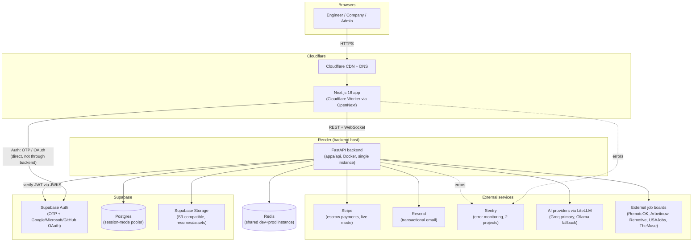

# Technical Architecture

Verified directly against the `prod` branch of `gokul-227/remote-ai-platform` on
2026-09-06.

## System overview



Two things worth calling out about this diagram: the frontend talks to Supabase
Auth **directly** for sign-in/sign-up (the backend is never in that path), and the
backend independently verifies whichever Supabase-issued token the frontend hands
it on every request — it never trusts the frontend's word for who the user is.

## Backend: domain-driven modular monolith

`apps/api/app/domains/` holds one subpackage per bounded context — **23** today
(the CLAUDE.md figure of 21 is out of date; `analytics` and `billing` were added
since). Each domain can have up to five files:

```
domains/<name>/
  models.py       # SQLAlchemy models
  schemas.py      # Pydantic request/response schemas
  repository.py   # DB access class
  service.py      # business logic
  router.py       # FastAPI APIRouter
```

Verified maturity as of today (not trusting older docs' claims):

| Layering | Domains |
|---|---|
| Fully layered (all 5 files) | `admin`, `analytics`, `auth`, `companies`, `engineers`, `jobs`, `matching`, `trust` |
| Partial (models + router + schemas, no repository/service split out) | `contracts`, `groups`, `payments`, `social` |
| Thin (models + router only) | `applications`, `network`, `notifications`, `saved_jobs`, `search` |
| Thinnest / not wired into the app | `quality` (router + schemas, no models yet); `billing` (models + an `entitlements` module, no router — built but not exposed); `marketplace` (models only, still not registered in `main.py`) |

All 21 domains that have a router are mounted in `apps/api/app/main.py` under a
shared `/api/v1` prefix. `billing` and `marketplace` exist as code but are not yet
reachable via any endpoint — `billing` in particular matches a known pending
decision ("pricing/plans — architecture built, zero real prices set yet").

`app/core/` holds cross-cutting concerns rather than being a domain itself:
config (`config.py`), the async DB engine (`database.py`), the exception
hierarchy (`exceptions.py`), S3-compatible storage helpers built on boto3
(`storage.py` — boto3 rather than the MinIO SDK specifically because it supports
Supabase Storage's path-style S3 endpoint), and middleware (`middleware.py`) for
request-ID tagging, in-process rate limiting, and — added in today's security
pass — a standard set of response security headers (`X-Content-Type-Options`,
`Permissions-Policy`, HSTS, and related).

## Authentication architecture — read this section carefully, it changed today

This is the area most likely to be described incorrectly by anything written
before today, so it is documented here precisely as the code exists on `prod`
right now, including the parts that are messier than a clean diagram would
suggest.

**Current live behavior (frontend):** the web app talks to Supabase Auth
directly, not through the FastAPI backend, for all sign-in and sign-up:
- **Email OTP ("passwordless")** — a user enters their email, Supabase emails
  a one-time code (via Resend SMTP, see `02-tech-stack.md`), the user enters the
  code and is signed in. No passwords are collected or stored for new sign-ins.
- **OAuth** — Google, Microsoft, and GitHub, all via
  `supabase.auth.signInWithOAuth()`.
- After Supabase issues a session, the frontend calls the backend's
  `GET /api/v1/auth/me` with the Supabase access token to fetch (or
  auto-provision, on first sight) this app's own user record — because role
  (`ENGINEER` / `COMPANY` / `ADMIN`) and profile data live only in this app's own
  `users` table, never in Supabase's identity token.

**Current live behavior (backend):** `apps/api/app/domains/auth/supabase_auth.py`
verifies Supabase-issued tokens by fetching Supabase's public JWKS keys and
checking the signature (ES256/RS256/EdDSA) — the backend never holds a Supabase
secret and never calls back to Supabase on the request path. This is selected by
`settings.AUTH_PROVIDER == "supabase"`. Both the WebSocket endpoints
(`/network/messages/ws/{conversation_id}` and `/notifications/ws/{user_id}`) were
fixed today to respect this same setting — previously they only ever checked
tokens against the old verifier below, which meant every real user's actual
session token failed WebSocket auth silently. Real-time messaging and
notifications had been non-functional in production until this fix.

**What still exists in the codebase, not yet removed (the "known, not-yet-resolved
consolidation question"):**
- `apps/api/app/domains/auth/service.py` still contains a complete, working
  self-issued JWT system (`AuthService.verify_token`, HS256, signed with
  `JWT_SECRET_KEY`) — this is the *default* value of `AUTH_PROVIDER` in code
  (`"custom_jwt"`), even though the live frontend no longer exercises it.
- `apps/api/app/domains/auth/router.py` still exposes the full set of
  legacy endpoints built on that system: `/auth/register`, `/auth/login`
  (or `/auth/token`), `/auth/refresh`, `/auth/forgot-password`,
  `/auth/reset-password`, `/auth/change-password`, `/auth/logout-all`.
- A **separate**, custom-built Google/Microsoft OAuth flow also still exists
  (`apps/api/app/domains/auth/oauth.py`, endpoints under `/auth/oauth/{provider}`)
  — distinct from, and not used by, the Supabase-based OAuth the frontend
  actually calls today.
- Keycloak references (`KEYCLOAK_*` settings, `/auth/login-url`, `/auth/logout-url`)
  also remain in config and code as leftovers from an earlier identity-provider
  design; Keycloak itself is not deployed or used anywhere in production.

None of this legacy code is reachable by the current frontend, but it is live
code, reachable by anyone who calls those endpoints directly, and it has not been
removed. Whether and when to delete it is listed as an open decision in
`REQUIRED_FROM_YOU.md` in this repo ("Auth system consolidation ... 'do it' or
'later'?") — this handbook does not resolve that decision, only documents that it
exists and precisely what code is affected.

Role is always decided by this backend's own `users` table, never read off any
identity provider's token — a deliberate design choice that holds across both the
legacy and current auth paths.

## AI / LLM layer

All AI calls go through [LiteLLM](https://github.com/BerriAI/litellm) —
application code never imports a provider SDK (OpenAI/Anthropic/Gemini/Groq)
directly. Call chain: `app/agents/*` → `app/services/ai/service.py` (`AIService`)
→ `app/agents/llm_client.py` (`LLMClient.complete()` /
`complete_structured_json()`) → `litellm.acompletion`.

- `LLMClient` resolves a primary model from `AI_PROVIDER`/`AI_MODEL`
  (`"provider/model"` format; code default is `ollama`/`qwen2.5`) and falls back,
  in order, through `AI_FALLBACK_PROVIDERS` if the primary call fails.
- Two concrete agents exist: `ResumeParserAgent.parse_resume_text()` (turns an
  uploaded resume into a structured engineer profile) and
  `JobEnricherAgent.enrich_job()` (enriches raw scraped job postings). Both
  prompt for structured JSON, parsed via `complete_structured_json` with a
  regex fallback for markdown-fenced JSON output.
- The documented dev/production default provider is Groq (`llama-3.1-8b-instant`),
  falling back to locally-hosted Ollama models — see `.env.example` in the public
  repo for the exact configured chain.
- Resume text extraction (PDF/DOCX → plain text) happens ahead of the AI step via
  `pypdf` and `python-docx`, in `apps/api/app/domains/engineers/resume_extraction.py`.

## Real-time features (WebSockets)

Two WebSocket endpoints exist:
- `/api/v1/network/messages/ws/{conversation_id}` — real-time messaging between
  users in a conversation.
- `/api/v1/notifications/ws/{user_id}` — real-time delivery of in-app
  notifications, backed by an in-process `ConnectionManager`
  (`app/core/ws_manager.py`) keyed per user.

Both endpoints authenticate the same way HTTP endpoints do (provider-aware,
respecting `AUTH_PROVIDER`) — as described above, this is what was broken for
every real user until today's fix. There is no separate Redis pub/sub fan-out for
WebSocket messages; connections are held in-process, which is consistent with
running a single backend instance (see `03-deployment-and-infrastructure.md`).

## Payments / escrow architecture

`apps/api/app/domains/payments/` implements a provider-neutral escrow model
(`app/services/payments/service.py` defines `PaymentProvider`, `EscrowProvider`,
and `PayoutProvider` protocols) with two concrete implementations:

- **`SandboxPaymentProvider`** — a deterministic in-memory fake that never
  contacts a real payment network. This is the default, and the only provider
  ever configured on the dev environment.
- **`StripePaymentProvider`** — a real Stripe integration using manual-capture
  `PaymentIntent`s as the escrow primitive: `authorize()` creates a PaymentIntent
  with `capture_method="manual"` and returns its `client_secret` for the frontend
  to confirm client-side via Stripe.js (the backend never touches raw card
  data); once confirmed, the intent sits in `requires_capture`, which this app
  treats as "funds held" (`ESCROWED`); `release()` captures it; `refund()`
  cancels or refunds it depending on whether it was already captured. Only
  activated when `PAYMENT_PROVIDER=stripe` and a real `STRIPE_SECRET_KEY` are
  configured — production only.

**Webhook handling and idempotency:** `POST /api/v1/payments/webhooks/stripe`
verifies every event's signature against `STRIPE_WEBHOOK_SECRET` before touching
the database, and is the *only* path that marks an escrow as actually funded
(since that requires the customer to have confirmed the PaymentIntent
client-side). A dedicated `stripe_webhook_events` table
(`app/domains/payments/models.py`) records one row per processed Stripe
`event_id` as its primary key — a retried or replayed webhook delivery hits a
primary-key conflict and is treated as an already-handled no-op rather than
being applied twice. Direct escrow creation (`POST /api/v1/payments/escrow`)
also accepts a client-supplied idempotency key to make repeated create-escrow
calls with the same key safe to retry.

Stripe Connect payouts (paying an individual engineer directly) are explicitly
**not implemented** — `StripePaymentProvider.payout()` raises `NotImplementedError`
with a comment explaining that per-recipient Stripe Connect onboarding would be
required first and hasn't been built.

## Celery: queues and scheduled tasks (background jobs)

`app/workers/celery_app.py` defines 4 named queues (`default`, `jobs`, `ai`,
`matching`) and a `beat_schedule` with 3 cron jobs (job-source sync every 6h,
trending-skills refresh every 12h, stale-match recompute daily). **This is not
currently what runs in production** — see `03-deployment-and-infrastructure.md`
for why job-source sync actually runs via a GitHub Actions cron instead, and
`decisions/0001-no-celery-worker-yet.md` for the reasoning.

## Job aggregators

`app/domains/jobs/aggregators/base.py` defines an abstract `BaseAggregator`
with `fetch_jobs()`. Five concrete adapters (`remoteok.py`, `arbeitnow.py`,
`remotive.py`, `usajobs.py`, `themuse.py`) each pull from one external job board
API and normalize results. `JobService.sync_all_job_sources()` fans out across
all five.

## Frontend structure

`apps/web/src/app/` is the Next.js App Router, with plain nested folders mapping
to personas: `engineer/*`, `company/*`, `admin/dashboard`, plus shared `auth/*`,
`jobs/*`, `projects/*`, `network/*`, `messages/*`. `src/lib/supabase.ts` holds the
Supabase client and the helpers described above (`fetchBackendUser`,
`applyPendingRegistration`); `src/lib/api.ts` is the shared axios instance for
talking to the FastAPI backend. Styling is a hand-rolled Tailwind v4 design
system in `globals.css`, not a component library like shadcn/ui (some older docs
describe shadcn/ui as the intended approach — that is not what was actually
built).

A real frontend test framework (Vitest + Testing Library) now exists — this is
new; earlier documentation correctly noted there was none.
