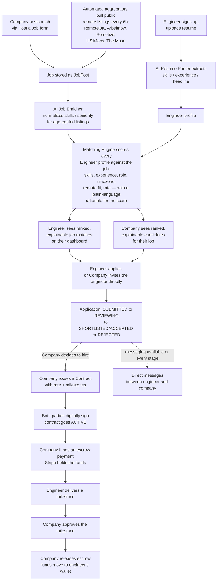

# Product Overview & Business Architecture

*Last verified against the live codebase: September 2026.*

## What this is

Remote AI Platform is a marketplace that connects **remote software engineers** with **companies hiring
for remote engineering roles**, with artificial intelligence doing two specific jobs in the middle:

1. **Reading resumes.** When an engineer uploads a resume, an AI model extracts their skills, work
   history, and headline automatically, instead of asking them to type it all in by hand.
2. **Explaining matches.** Instead of a black-box "you're 87% compatible" score, the platform computes a
   match between an engineer and a job from real, visible factors (skills overlap, seniority fit, role
   fit, timezone, remote-work preference, and rate) and shows *why* a match scored the way it did.

Around that AI core sits a fairly complete professional-network product: company and engineer profiles,
job search and applications, a LinkedIn-style social feed, direct messaging, groups, saved jobs,
notifications, and — for the hiring side — digital contracts and escrow-style payments once someone is
actually hired.

## Who it's for

**Engineers ("Professionals")** come to the platform to build a profile once (with AI doing the heavy
lifting from their resume), discover remote roles that are genuinely relevant to them, understand at a
glance why a role is or isn't a good fit, apply, and manage the process — messaging, tracking application
status, and eventually signing a contract and getting paid — in one place.

**Companies** come to the platform to post open remote roles, see qualified candidates surfaced and
ranked automatically rather than sifting through hundreds of unfiltered resumes, review and manage
applications, message candidates directly, and — for roles that convert to a hire — issue a contract and
run payment through an escrow-style flow instead of an informal invoice-and-wire-transfer arrangement.

**Admins** (the platform operator, today effectively the founder) come to the platform to keep the lights
on: see how many engineers/companies/jobs exist, watch the automated job-import pipeline for failures,
keep an eye on what the AI features are costing in LLM tokens, manage user accounts, and act on anything
flagged for moderation.

## The three personas, in one sentence each

| Persona | What they come to do |
|---|---|
| **Engineer** | Get discovered and matched for real remote roles with minimal manual busywork. |
| **Company** | Post a role once and get a ranked, explainable shortlist instead of a resume pile. |
| **Admin** | Keep the marketplace, the AI pipeline, and the job-import pipeline healthy. |

## End-to-end business flow

This diagram shows the actual, current mechanics of how a job moves from being posted to a completed,
paid engagement — not an idealized future state. Where a step exists in the code but isn't fully wired
end-to-end for a normal user, that's called out directly underneath.

**What's real vs. what's aspirational in this flow, honestly:**

- Job posting, AI enrichment for aggregated jobs, resume parsing, the explainable match score,
  applications (submit / invite / status transitions), messaging, contracts, digital signing, and
  Stripe-backed escrow (authorize → hold → release/refund, with a real webhook confirming funded status)
  are all implemented and wired end-to-end in the current codebase.
- The "Company invites an engineer directly" path re-uses the same application record as a normal
  apply — there's no separate outreach/sourcing product yet.
- Contracts and escrow payments are a genuinely working feature set, but they are **not gated on an
  application actually reaching ACCEPTED** — a company can create a contract for any user it knows the ID
  of. In practice today it's used as the natural next step after a hire decision, but the system doesn't
  enforce that sequencing.
- There is no in-product concept of "project completion" closing out a contract automatically — a
  contract moves through milestone approvals, but marking a contract COMPLETED vs. leaving it ACTIVE
  indefinitely is a manual/informal step today.

## Business model — the honest current state

**Everything on the platform is free to use today.** There is no billing domain in the backend, no
subscription/plan model, and no paywall anywhere in the product — every feature described in this
handbook (AI matching, unlimited job postings, unlimited applications, messaging, contracts, escrow) is
available to every engineer and company account at no cost.

This is a deliberate, temporary decision, not an oversight: the plan is to prove out usage and value
first, then introduce paid plans and feature gating later. When that happens, the natural places to meter
are visible in the product already — job-posting volume for companies, advanced search/matching depth,
and priority placement are the likely candidates — but none of that exists in the code today, and this
document should not be read as describing a finished pricing model. Anyone evaluating the business today
should treat "free for everyone, monetization is a future step" as the accurate, current answer.

The one piece of real payments infrastructure that *does* exist is the **escrow system between a company
and an engineer once a contract is signed** (Stripe-backed, with a sandbox/mock provider also available
for testing) — but that is a value-add for facilitating a hire, not a platform revenue mechanism. The
platform does not currently take a fee, commission, or cut from any escrow transaction; the full contract
amount flows from company to engineer.
