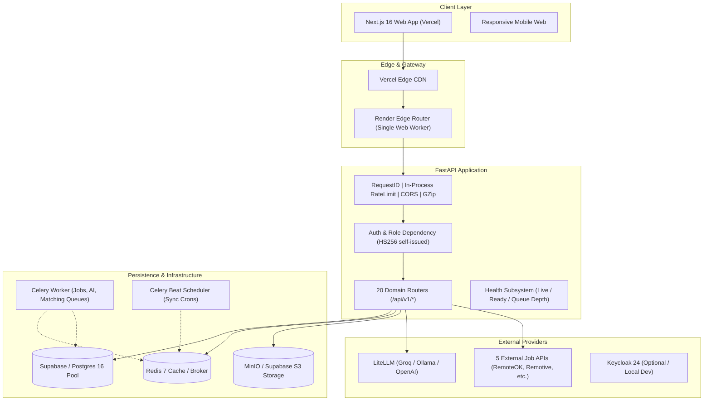

# Enterprise Gap Analysis — Remote AI Platform (WorkMesh AI)

**Assessment Date**: 2026-08-26  
**Auditor**: Principal Systems Architect, Staff Full-Stack Engineer, Security Engineer, SRE, QA & UX Systems Lead  
**Target Repository**: `gokul-227/remote-ai-platform`  
**Production Targets**: Frontend (Cloudflare Workers), Backend (Render), Database (Supabase PostgreSQL / asyncpg), Storage (Supabase Storage / MinIO S3 API). See the internal deployment docs for live URLs and identifiers.

---

## Executive Summary & Current Truth

A comprehensive forensic inspection of every backend domain, database migration (`001_initial_schema.py` through `022_groups.py`), API router, Pydantic schema, Celery worker task, middleware, frontend Next.js route, component, and deployment manifest reveals a powerful, broad two-sided engineering marketplace and work execution platform.

However, the system currently straddles the boundary between a feature-rich prototype and a true production-grade enterprise SaaS platform. While core business flows (job aggregation across 5 sources, deterministic AI matching, engineer profiles, basic project management, chat via WebSocket, and social feed) have working implementations, there are critical production blockers (P0), architectural fragmentation (P1), sandbox illusions (P1), and security/authorization gaps (P0/P1) that must be systematically resolved.

```
+----------------------------------------------------------------------------------------------------+
|                                    PLATFORM MATURITY SCORECARD                                     |
+------------------------------+--------------------+------------------------------------------------+
| Dimension                    | Rating (1-5)       | Critical Gap Summary                           |
+------------------------------+--------------------+------------------------------------------------+
| Architecture & Foundations   | 3.8 / 5.0          | In-process rate limiting, single-instance deps |
| Security & Identity          | 2.9 / 5.0          | Missing pwd reset/session revocation/BOLA gaps |
| Infrastructure & Queues      | 2.5 / 5.0          | Render web-only deploy; Celery disconnected    |
| Data Model & Consistency     | 3.2 / 5.0          | 3 duplicate milestone models, 2 post models    |
| Financial & Ledger Integrity | 2.1 / 5.0          | Sandbox-only escrow; no real payment rail     |
| AI Platform & Observability  | 3.6 / 5.0          | Silent degradation; no token budget/rate limit |
| Frontend & UX Engineering    | 3.7 / 5.0          | Hydration quirks; disconnected sub-paths       |
| Automated Verification & QA  | 3.4 / 5.0          | 93 backend tests pass; E2E lacks deep coverage |
+------------------------------+--------------------+------------------------------------------------+
```

---

## 1. System Architecture Audit



### 1.1 Frontend Architecture (`apps/web`)
- **Framework**: Next.js 16.2.11 (App Router), React 19.2.4, TypeScript 5.
- **Styling**: Tailwind CSS v4 token-based design system (`globals.css`), CSS variables with light/dark theme toggle, custom surface elevation tokens.
- **State & Data Fetching**: TanStack React Query (`^5.66.0`) with custom API client (`axios` wrapper at `@/lib/api`) featuring token injection and 401 refresh retry queue.
- **Form Management**: React Hook Form (`^7.54.2`) with Zod validation schemas (`^3.24.2`).
- **Gaps Identified**:
  1. Systemic hydration mismatch risk where server-rendered markup encounters client-only `localStorage` auth state.
  2. Legacy split route trees (`/engineer/*` and `/company/*`) coexist with top-level `/workspace` and shared feature routes (`/projects`, `/contracts`, `/jobs`), causing cognitive fragmentation.

### 1.2 Backend Architecture (`apps/api`)
- **Framework**: FastAPI (Python 3.11/3.12), ASGI asynchronous architecture.
- **ORM & Database Driver**: SQLAlchemy 2.0 Async (`AsyncSession`) with `asyncpg` driver and connection pooling (`DATABASE_POOL_SIZE=10`, `DATABASE_MAX_OVERFLOW=20`).
- **Logging & Telemetry**: `structlog` contextual JSON logging bound with `X-Request-ID`, Prometheus FastAPI Instrumentator exposing `/metrics`.
- **Gaps Identified**:
  1. In-process `RateLimitMiddleware` using in-memory `collections.deque`. Multi-worker or multi-replica deployments do not share rate-limiting state.
  2. Lifespan startup executes `python -m alembic upgrade head` via subprocess and calls `seed_demo_data()` without environment gating, risking overwriting or seeding default credentials in production.

### 1.3 Background Job Architecture (Redis & Celery)
- **Local Development**: Docker Compose runs dedicated `redis`, `celery-worker`, and `celery-beat` containers across 4 defined queues (`default`, `jobs`, `ai`, `matching`).
- **Production Truth (Render)**: `infra/deploy/render.yaml` defines a single free-tier web service with **no Redis or Celery worker**.
- **Critical Production Risk**: If any backend code triggers an async Celery task (`.delay()`), or if `CELERY_BROKER_URL` defaults to `localhost:6379`, requests either fail, timeout, or block. Job synchronization currently relies on an external GitHub Actions cron workflow hitting `POST /api/v1/jobs/sync`.

### 1.4 AI Architecture (`apps/api/app/services/ai`, `app/agents`)
- **Integration**: `AIService` wrapping `LLMClient` backed by `litellm`. Zero vendor lock-in; supports Groq, Ollama, OpenAI with fallback chain.
- **Specialized Agents**: `ResumeParserAgent`, `JobEnricherAgent`, `QualityEngineAgent`, `ProjectPlannerAgent`.
- **Gaps Identified**:
  1. Silent failure: On complete provider failure, `LLMClient.complete()` returns empty JSON `"{}"` and agents populate fallback boilerplate without warning the caller that AI is unavailable or degraded.
  2. No token quotas, cost tracking persistence per organization, or rate limits per tenant for AI usage.

---

## 2. Complete Domain Inventory & Status Matrix

| Domain | Backend Router / Model | Frontend Route / Components | Current State | Production Risk | Recommended Action |
|---|---|---|---|---|---|
| **Authentication** | `POST /auth/register`<br>`POST /auth/login`<br>`POST /auth/refresh`<br>`PATCH /auth/role` | `/auth/login`<br>`/auth/register`<br>`WorkspaceSwitcher.tsx` | **WORKING** (Self-issued HS256) | High (No password reset, no email verification, no session revocation) | Add password reset token flow, email verification, session revocation table, and harden JWT verification. |
| **Engineers** | `/engineers/me`<br>`/engineers/{id}`<br>`/engineers/me/resume` | `/profile`<br>`/engineer/dashboard`<br>`/engineer/profile` | **WORKING** | Medium (Resume upload relies on MinIO/S3; PDF parser needs strict validation) | Add Sentry/audit logging, validate PDF magic bytes, support resume re-parsing. |
| **Companies** | `/companies/me`<br>`/companies/{id}` | `/company/profile`<br>`/company/dashboard`<br>`/companies` | **WORKING** | Low | Enhance company verification badges and team membership linkage. |
| **Jobs Aggregator** | `/jobs`<br>`/jobs/{id}`<br>`/jobs/sync` | `/jobs`<br>`/jobs/[id]`<br>`JobCard.tsx` | **WORKING** (5 adapters: RemoteOK, Arbeitnow, Remotive, USAJobs, TheMuse) | Low | Add health monitoring per source adapter and dead-link detection. |
| **Matching Engine** | `/matching/jobs`<br>`/matching/engineers` | `/recommendations`<br>`MatchScoreRing.tsx` | **WORKING** (Deterministic 6-factor weighted sum) | Low | Keep deterministic algorithm; add explicit `[0, 100]` clamp and semantic embedding cache. |
| **Applications** | `/applications`<br>`/applications/{id}` | `/applications`<br>`/company/candidates` | **WORKING** | Medium (Status transitions lack strict state machine validation) | Enforce formal state machine: `APPLIED -> SCREENING -> INTERVIEWING -> OFFERED -> HIRED / REJECTED`. |
| **Contracts** | `/contracts`<br>`/contracts/{id}`<br>`/contracts/{id}/sign` | `/contracts`<br>`/contracts/[id]` | **WORKING** | High (Duplicated milestone model vs Project domain) | Unify contract milestone structure with canonical project milestones; add digital signature audit trail. |
| **Projects & Work** | `/projects`<br>`/projects/{id}`<br>`/projects/{id}/tasks` | `/projects`<br>`/projects/[id]` | **WORKING** | High (Milestones, Task Offers, Submissions, Work Ledger have overlapping concepts) | Consolidate `Milestone`, `ContractMilestone`, and `WorkLedgerEntry` into a single canonical work execution engine. |
| **Quality Engine** | `/quality/evaluate`<br>`/quality/review-code` | `/quality`<br>`QualityEngine.tsx` | **WORKING** (Unguarded frontend route previously) | Medium (Standalone page disconnected from project submission flow) | Integrate AI Code Review directly into task work submission and milestone approval workflows. |
| **Trust & Reputation** | `/trust/{user_id}`<br>`/trust/{user_id}/score` | `TrustBadge.tsx`<br>Profile pages | **WORKING** | Medium (Verification records lack admin review flow) | Separate AI Match Score from Verified Trust Score; add verification evidence submission and admin audit. |
| **Payments & Escrow** | `/payments/wallet`<br>`/payments/transactions`<br>`/payments/escrow` | `/payments`<br>`/payments/escrow` | **MOCKED (Sandbox Only)** | Critical (Appears functional but uses `SandboxPaymentProvider`) | Clearly badge sandbox mode; build Stripe Connect architecture with webhook verification and immutable ledger. |
| **Network & Chat** | `/network/connections`<br>`/network/conversations`<br>`/messages/ws/{id}` | `/network`<br>`/messages`<br>`MessageBubble.tsx` | **WORKING** (WebSocket + Redis pub/sub + local fallback) | Low | Add message read receipts, attachment security scans, and conversation search. |
| **Social Feed** | `/social/posts`<br>`/social/posts/{id}/like` | `/feed`<br>`PostCard.tsx` | **WORKING** | Medium (Duplicate post model in Groups domain) | Unify global post feed with group posts; support rich media attachments safely. |
| **Groups & Communities** | `/groups`<br>`/groups/{id}/posts` | `/groups`<br>`/groups/[slug]` | **WORKING** | Medium (Separate `GroupPost` table from `Post`) | Unify post architecture with polymorphic group/feed context. |
| **Notifications** | `/notifications`<br>`/notifications/{id}/read` | `/notifications`<br>`TopNavbar.tsx` | **WORKING** (In-app polling) | Low | Add WebSocket push notification dispatch and user preference toggles. |
| **Admin Operations** | `/admin/dashboard`<br>`/admin/users`<br>`/admin/health/details` | `/admin`<br>`/admin/users`<br>`/admin/infrastructure` | **WORKING** | High (Auto-seeded default admin credentials; missing queue operations) | Disable default credential seeding in production; add Celery queue monitoring and immutable audit logging. |
| **Marketplace** | Domain folder has `models.py` only | N/A | **DEAD CODE** | Low | Consolidate models into `projects` and `jobs` or wire cleanly into canonical lifecycle. |

---

## 3. Security, Authorization & Privacy Audit

### 3.1 Credentials & Secret Management
- **Git History & Repo Check**: No active private API keys or production database passwords found committed in repository source code.
- **Vulnerability**: `app/scripts/seed_data.py` auto-provisions `admin@workmesh.ai` with password `admin123` if the user is missing. If run on a public production instance without an admin password change, it creates an immediate takeover vulnerability.
- **Remediation**: Guard seeding behind `if settings.is_development and settings.SEED_DEMO_DATA:`. Fail startup if default credentials are used in production.

### 3.2 Authentication & Session Architecture
- **Current Pattern**: Self-issued JWTs (HS256) signed with `JWT_SECRET_KEY` (15 min access, 7 day refresh).
- **Gaps**:
  1. No server-side session revocation table or Redis token blocklist. Logging out is purely client-side token discard.
  2. No password reset flow (no forgot password endpoint, no signed reset token dispatch).
  3. No email verification requirement before performing sensitive marketplace actions.
  4. No brute-force protection on `/auth/login` beyond the simple in-process sliding window limiter.

### 3.3 Authorization & Access Control (IDOR / BOLA)
- **Strengths**: `require_role(UserRole.COMPANY, UserRole.ADMIN)` is consistently used across protected routes. Project endpoints verify ownership (`can_access` checks `CompanyProfile.id == project.company_id` or `ProjectMember.user_id == user.id`).
- **Gaps Identified**:
  1. `POST /contracts`: Client ID must match authenticated user's ID or company; verify worker cannot forge contracts on behalf of arbitrary clients.
  2. `POST /social/posts/{id}/comments`: Verify comments cannot be added to private posts unless connection or membership exists.
  3. `GET /engineers/{id}`: Sensitive private contact info (email, phone) must be redacted unless an active contract or approved application exists between viewer and engineer.

### 3.4 CORS & Transport Security
- **CORS Configuration**: Correctly parses comma-separated `CORS_ORIGINS`.
- **Validation**: `Settings.validate_production_settings()` explicitly rejects `*` wildcard when in production to prevent credentialed cross-origin hijacking.

---

## 4. Infrastructure, Deployment & Background Workers

### 4.1 Production Render Blueprint Analysis (`infra/deploy/render.yaml`)
- **Current Blueprint**: Defines a single Docker web service for FastAPI on Render's free tier.
- **The Celery Disconnect**: Because Render free tier does not include Redis or long-running worker processes, the Celery worker and beat scheduler are not deployed on Render.
- **Consequence**: Tasks dispatched asynchronously via Celery are lost or throw connection errors in production unless:
  - An external Redis instance (e.g. Upstash / Redis Cloud) is configured via `CELERY_BROKER_URL`.
  - A background worker service is declared in `render.yaml` or jobs are handled via in-process background tasks (`fastapi.BackgroundTasks`) as a fallback.

### 4.2 Health Subsystem Audit (`/api/v1/health`, `/admin/health/details`)
- **Real Checks**:
  - `_check_postgres`: Executes `SELECT 1` on database pool with latency measurement.
  - `_check_redis`: Executes `PING` against `CELERY_BROKER_URL` with 1s timeout.
  - `_check_minio`: Runs short-timeout `list_buckets()` via thread pool.
  - `_check_keycloak`: Checks OIDC realm status if `FEATURE_KEYCLOAK_AUTH=true`.
  - `_check_celery_queues`: Inspects Redis queue lengths.
- **Architectural Gaps**:
  1. Health endpoints are nested under `/api/v1/health` while standard cloud load balancers often check `/health/live` and `/health/ready`.
  2. Need distinct liveness (`/health/live` — process up) and readiness (`/health/ready` — database & broker reachable) endpoints.

---

## 5. Data Model & Schema Consistency Audit

```
Duplicate & Fragmented Concepts:
1. Milestones:
   ├── `milestones` table (Project domain: title, description, position, status)
   ├── `contract_milestones` table (Contracts domain: title, amount, status, due_date)
   └── `work_ledger_entries` table (Work duration, status, void tracking)

2. Posts & Social Content:
   ├── `posts` table (Global feed: author_id, content, visibility, likes, comments)
   └── `group_posts` table (Group feed: group_id, author_id, content, likes, comments)

3. Task Assignments:
   ├── `project_tasks.assigned_user_id` (Direct assignment)
   └── `task_assignment_offers` (Formal candidate proposal/offer workflow)
```

- **Database Integrity Findings**:
  - Foreign keys with `ON DELETE CASCADE` or `SET NULL` are well-specified across all 22 migration revisions.
  - Indexing is present on primary search keys (`external_id`, `user_id`, `company_id`, `created_at`).
  - Missing: Explicit composite indexes on `(company_id, status)` and `(assigned_user_id, status)` for high-volume project task queries.
  - Soft Deletes: Missing `is_deleted` or `deleted_at` on key entities (`JobPost`, `Project`, `Contract`), resulting in permanent data loss on delete.

---

## 6. Frontend Quality, Accessibility & Design System

- **Design System Consistency**: Rich enterprise theme with curated brand blue (`#2563eb`), slate dark palette (`#0f172a`), semantic status badges, and glassmorphism headers.
- **Accessibility (WCAG 2.2 AA) Audit**:
  - Contrast ratios for text meet 4.5:1 in both light and dark modes.
  - Interactive elements in `TopNavbar` and `WorkspaceSwitcher` have `aria-haspopup`, `aria-expanded`, and `role="listbox"`.
  - Focus outlines are visible on keyboard navigation.
- **Gaps Identified**:
  1. Standalone pages (`/quality`, `/freelancers`) lack contextual breadcrumbs linking back into the active workspace.
  2. Error state handling in several query hooks renders raw error messages instead of user-friendly recovery prompts with retry buttons.

---

## 7. Automated Testing Audit

- **Backend Test Suite**: 93 passing unit and integration tests under `apps/api/tests`.
  - `test_auth.py`: Token generation, registration, password hashing.
  - `test_matching.py`: 6-factor deterministic scoring and sub-score boundary verification.
  - `test_project_management.py`: Task creation, dependencies, work submissions, review notes.
  - `test_groups.py`: Group creation, slug collisions, memberships, posts.
  - `test_quality_engine.py`: AI code review and submission evaluation mocking.
- **Testing Gaps**:
  1. No cross-tenant authorization security tests (e.g. asserting User A cannot access User B's contract or project).
  2. No automated frontend unit/component tests (Jest/Vitest not configured in `apps/web`).
  3. Playwright E2E tests in `tests/e2e` cover happy paths but lack adversarial/negative security journey tests.

---

## 8. Summary of Prioritized Gaps (P0 - P3)

```
[P0] PRODUCTION BLOCKERS
├── P0-1: Disable auto-seeding of default admin credentials in production
├── P0-2: Production Redis & background worker configuration path (render.yaml / fallback)
├── P0-3: True readiness (/health/ready) and liveness (/health/live) split
└── P0-4: Automated cross-tenant authorization and IDOR test suite

[P1] CORE ENTERPRISE ARCHITECTURE
├── P1-1: Password reset, change password, and session revocation system
├── P1-2: Redis-backed distributed rate limiting middleware
├── P1-3: Consolidated Work & Milestone lifecycle (Contract -> Project -> Milestone -> Task -> Submission -> Review)
├── P1-4: Transparent payment rail status (Honest Sandbox / Stripe Connect architecture)
└── P1-5: Immutable Audit Logging for compliance and security events

[P2] PRODUCT DEPTH & WORKSPACE COHERENCE
├── P2-1: Unified workspace experience (Personal vs Organization vs Admin)
├── P2-2: Verified Trust & Reputation scoring separated from AI Match score
├── P2-3: AI Copilot resiliency & visible degradation states (no silent empty JSON)
└── P2-4: Unified Social & Community architecture

[P3] SCALE, OBSERVABILITY & POLISH
├── P3-1: Admin queue monitor and background job operational console
├── P3-2: Database indexing and soft-delete strategy
├── P3-3: WCAG 2.2 AA accessibility audit & automated CI testing
└── P3-4: Comprehensive system runbooks and production deployment documentation
```
