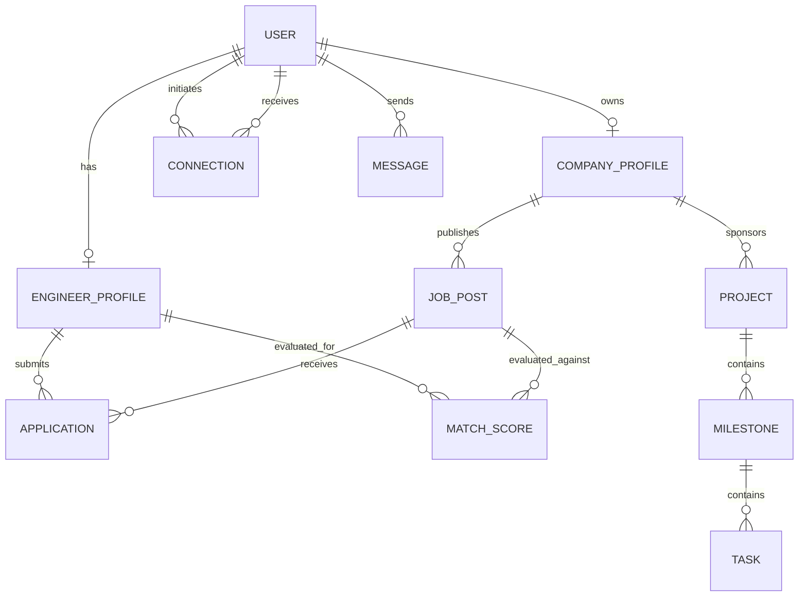

# WorkMesh AI — Domain Model Specifications

This document describes the primary domain entities, their key attributes, and relationship constraints.

## 1. Auth & Users (`User`)
- **Attributes**: `id` (UUID), `email` (string, unique), `hashed_password` (string), `role` (enum: `ENGINEER`, `COMPANY`, `ADMIN`), `is_active` (bool), `is_verified` (bool), `created_at`, `updated_at`.

## 2. Engineer Profiles (`EngineerProfile`)
- **Attributes**: `id` (UUID), `user_id` (FK -> User), `full_name`, `headline`, `bio`, `location`, `country`, `timezone`, `skills` (JSON/Array), `years_experience` (int), `hourly_rate`, `preferred_salary`, `github_url`, `linkedin_url`, `portfolio_url`, `resume_url`, `profile_completeness` (int), `availability` (string).

## 3. Company Profiles (`CompanyProfile`)
- **Attributes**: `id` (UUID), `user_id` (FK -> User), `name`, `logo_url`, `website`, `industry`, `company_size`, `description`, `tech_stack` (JSON/Array), `is_verified` (bool).

## 4. Jobs & Aggregation (`JobPost`)
- **Attributes**: `id` (UUID), `company_id` (FK -> CompanyProfile, optional), `source` (enum: `INTERNAL`, `REMOTEOK`, `REMOTIVE`, `ARBEITNOW`, `USAJOBS`, `THEMUSE`), `external_id` (string), `title`, `description`, `requirements`, `skills_extracted` (JSON/Array), `salary_min`, `salary_max`, `currency`, `location`, `remote_policy`, `original_url`, `posted_at`, `is_active` (bool).

## 5. AI Matching (`MatchScore`)
- **Attributes**: `id` (UUID), `engineer_id` (FK), `job_id` (FK), `overall_score` (int 0-100), `skill_match` (int), `experience_match` (int), `role_match` (int), `timezone_match` (int), `compensation_match` (int), `remote_match` (int), `explanations` (JSON).

## 6. Social Network (`Connection`, `Post`)
- **Connection**: `id`, `requester_id` (FK), `addressee_id` (FK), `status` (enum: `PENDING`, `ACCEPTED`, `REJECTED`, `BLOCKED`, `WITHDRAWN`).
- **Post**: `id`, `author_id` (FK), `content`, `image_url`, `created_at`.

## 7. Real-Time Messaging (`Conversation`, `Message`)
- **Conversation**: `id`, `created_at`.
- **Message**: `id`, `conversation_id` (FK), `sender_id` (FK), `content`, `is_read` (bool), `sent_at`.

## 8. Projects & Task Dispatch (`Project`, `Milestone`, `Task`)
- **Project**: `id`, `company_id` (FK), `title`, `description`, `status` (enum: `DRAFT`, `AI_PLANNING`, `APPROVED`, `IN_PROGRESS`, `COMPLETED`), `ai_plan` (JSON).
- **Milestone**: `id`, `project_id` (FK), `title`, `due_date`, `status`.
- **Task**: `id`, `milestone_id` (FK), `title`, `skills_required` (JSON), `assigned_worker_id` (FK), `status` (enum: `OPEN`, `OFFERED`, `ASSIGNED`, `IN_PROGRESS`, `SUBMITTED`, `APPROVED`).
